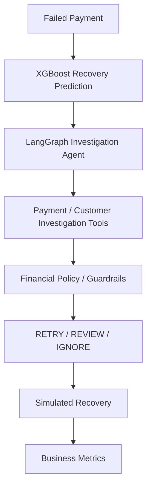

# RevenueGuard

**AI-powered revenue recovery and failed-payment investigation platform.**

## About RevenueGuard

RevenueGuard is a planned platform that helps businesses recover revenue lost to failed payments. For each failed payment, it will predict how likely the payment is to be recovered, investigate the failure with an AI agent, and apply financial policy guardrails to decide whether the payment should be retried, sent for human review, or ignored. Recovery attempts are simulated, and their outcomes feed business metrics so the impact of every decision can be measured.

## The Problem It Solves

Failed payments represent a large, largely unmanaged revenue leak:

- **Recoverable revenue is lost silently** — legitimate customers' payments fail for temporary reasons (insufficient funds, expired cards, transient gateway issues) and are never retried effectively.
- **Retries are undifferentiated** — naive retry strategies treat every failed payment the same, wasting attempt budgets on unrecoverable payments while missing recoverable ones.
- **Investigation is manual** — understanding why a payment failed requires digging through payment and customer records by hand.
- **Outcomes are unmeasured** — teams rarely know how much revenue their recovery efforts actually recover.

RevenueGuard is being designed to turn failed-payment recovery into a predicted, investigated, policy-guarded, and measured process.

## Planned Architecture

RevenueGuard will process each failed payment through the following pipeline:



- **XGBoost Recovery Prediction** — a trained model estimates the probability that a failed payment can be successfully recovered.
- **LangGraph Investigation Agent** — an agent orchestrates the investigation of each failed payment, deciding which checks to run and in what order.
- **Payment / Customer Investigation Tools** — focused tools the agent calls to inspect payment and customer context.
- **Financial Policy / Guardrails** — hard rules and limits that constrain what the agent is allowed to decide.
- **RETRY / REVIEW / IGNORE** — the three possible outcomes: retry the payment automatically, escalate for human review, or take no action.
- **Simulated Recovery** — recovery attempts are simulated so decision quality can be evaluated safely before touching real money flows.
- **Business Metrics** — recovered amount, recovery rate, and related KPIs quantify the system's impact.

## Planned Technology Stack

The project is Python-oriented. The current plan:

- **Language:** Python 3.x
- **Recovery prediction:** XGBoost
- **Agent orchestration:** LangGraph
- **Agent tracing and evaluation:** LangSmith (later)
- **Application persistence:** PostgreSQL (later)
- **Backend API:** FastAPI (later)
- **Analyst dashboard:** React + TypeScript (later)
- **Tool interface:** MCP (later — exposes the existing investigation tools through a standardized tool interface)
- **Version control and collaboration:** Git / GitHub

Dependencies will be introduced only as each phase of the project actually requires them.

## Project Structure

```text
RevenueGuard/
├── README.md
├── .gitignore
├── .env.example
├── requirements.txt
├── data/
│   ├── customers.csv
│   ├── transactions.csv
│   ├── payment_attempts.csv
│   └── payment_failures.csv
├── scripts/
│   └── generate_data.py
├── agent/
│   ├── __init__.py
│   ├── graph.py
│   ├── state.py
│   ├── tools.py
│   └── prompts.py
└── tests/
    ├── test_data_quality.py
    └── test_determinism.py
```

## Dataset Schema

The synthetic dataset is generated by `scripts/generate_data.py` (Python stdlib only, no dependencies):

```bash
python scripts/generate_data.py    # default: --seed 42 --num-customers 4000 --output-dir data
```

The generator is fully deterministic — a fixed seed produces byte-identical output, verified by tests. It produces approximately 4,000 customers, 18,200 transactions, 21,300 payment attempts, and 4,300 failure records. Failure records are one row per failed attempt, including failed retries, so their count naturally exceeds the number of initially failed transactions.

### Tables

| Table | Columns | Notes |
|---|---|---|
| `customers.csv` | `customer_id` (PK, `CUST-######`), `signup_date`, `customer_segment` (`retail` \| `smb` \| `enterprise`), `country` (`US` \| `GB` \| `DE` \| `IN` \| `CA` \| `AU`), `preferred_payment_method` (`card` \| `bank_transfer` \| `digital_wallet`) | one row per customer |
| `transactions.csv` | `transaction_id` (PK, `TXN-#######`), `customer_id` (FK), `created_at`, `amount`, `currency`, `payment_method`, `status` (`completed` \| `failed`), `recovery_outcome` (`not_applicable` \| `recovered_retry` \| `recovered_review` \| `unrecovered`) | `failed` ⇔ the transaction has at least one failure |
| `payment_attempts.csv` | `attempt_id` (PK, `ATT-#######`), `transaction_id` (FK), `attempt_number` (1..N), `attempted_at`, `status` (`succeeded` \| `failed`), `payment_method` | attempts are chronological per transaction |
| `payment_failures.csv` | `failure_id` (PK, `FAIL-#######`), `attempt_id` (FK, 1:1 with failed attempts), `transaction_id` / `customer_id` (denormalized), `failed_at`, `failure_reason`, `processor_response_code` | one row per failed attempt |

### Failure reasons and processor response codes

| Reason | Code | Retry class |
|---|---|---|
| `insufficient_funds` | 51 | auto-retryable, high recovery |
| `expired_card` | 54 | non-retryable on same method → review path |
| `invalid_payment_method` | 14 | non-retryable on same method → review path |
| `temporary_network_error` | 91 | auto-retryable, high recovery |
| `bank_unavailable` | 96 | auto-retryable, high recovery |
| `payment_method_limit_exceeded` | 61 | auto-retryable, moderate recovery |
| `risk_review_hold` | 57 | no auto-retry → review path |

Behavioral traits (e.g., per-customer payment reliability) are latent generation variables and are deliberately **not** exported as columns.

### Leakage notes

`recovery_outcome`, the attempt history, and the failure rows are the **label side** of the dataset. Later ML work must build features only from information available at prediction time (customer profile, transaction fields, and pre-outcome history). The schema deliberately avoids pre-computed behavior aggregates so target leakage cannot creep in through convenience columns.

## Project Status

RevenueGuard is being developed **incrementally**. Current progress:

- [x] Project foundation and architecture documentation (Phase 0)
- [x] Synthetic failed-payment dataset (Phase 1)
- [ ] XGBoost recovery prediction model
- [ ] LangGraph investigation agent
- [ ] Payment / customer investigation tools
- [ ] Financial policy / guardrails
- [ ] Simulated recovery and business metrics
- [ ] LangSmith tracing and evaluation
- [ ] PostgreSQL persistence
- [ ] FastAPI backend
- [ ] React + TypeScript analyst dashboard
- [ ] MCP tool interface

All unchecked components are **planned and not yet implemented**. The dataset and its generator are complete tooling; no application functionality exists yet.
